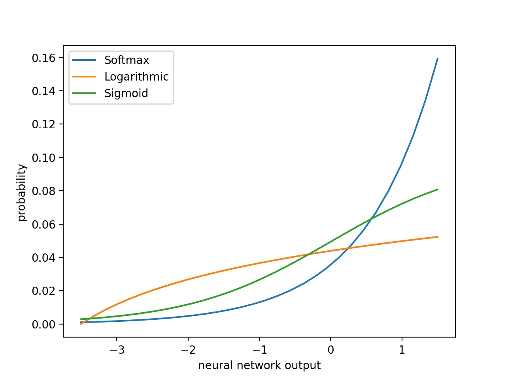

# probabilistic-regression-neural-network

## 1. Introduction
---------------

With the increasing number of real-world decision-making systems using black box models such as neural networks, there is a growing distrust in the decisions they make. Most models make decisions in ways that are very difficult to interpret, and for many applications there is also a lack of indication of confidence in the predictions. This can result in discriminatory and fundamentally bad decisions, especially in cases that are not easily generalized and a human must supervise the decision.

In this project, a regression neural network with a probability indicator is proposed without having to provide training samples with this information. This allows systems to make decisions only when predictions are reliable, minimizing harm.

## 2. Modeling and Data
--------------------

### 2.1. Data

### 2.2. Architecture

The size of the last learning layer is determined by the number of different intervals specified for a given dataset.

    

Since it has been proven that modern deep neural networks tend to be overconfident [2], probability normalization functions other than Softmax have been proposed.

    
    
    

## 3. Results
----------

    

## 4. Conclusions
--------------

## 5. Future Work
--------------

- Implementation of the calibration methods proposed in [2].

## 6. References
-------------

[1] [Vossen, Julian & Feron, Baptiste & Monti, A.. (2018). Probabilistic Forecasting of Household Electrical Load Using Artificial Neural Networks. 10.1109/PMAPS.2018.8440559.](https://www.researchgate.net/publication/325194613_Probabilistic_Forecasting_of_Household_Electrical_Load_Using_Artificial_Neural_Networks)

[2] [Chuan Guo, Geoff Pleiss, Yu Sun, Kilian Q. Weinberger. On Calibration of Modern Neural Networks. arXiv preprint arXiv:1706.04599, 2017](https://arxiv.org/pdf/1706.04599.pdf)

